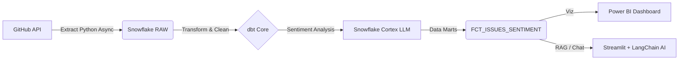

# Open Source Communities Sentiment Tracking


An End-to-End Data Engineering Project that analyzes the "health" and sentiment of Open Source communities (like Pandas, dbt, Prefect) by processing thousands of GitHub Issues using **Snowflake Cortex (AI)** and serving insights via a **Power BI Dashboard** and an **AI-powered Chatbot**.

**Core Value Proposition:**
This project democratizes data access. By syncing a powerful Data Warehouse with an LLM, **users don't need technical skills or SQL knowledge**. They can query complex datasets using natural language, effectively using the AI as an on-demand Data Analyst.

#### For demonstration, all the issues from the repositories *dbt-core, pandas, prefect, and streamlit* that had been created or updated on the year 2025 have been extracted.
---

## Architecture


---
##  Key Features

* **Highly Modular & Decoupled:** The architecture separates Extraction, Storage, and Logic. You can swap the data source (GitHub) for any other API without breaking the downstream transformation or AI layers.
* **Universal Sentiment Engine:** The Snowflake Cortex implementation is **source-agnostic**. It works equally well for analyzing **Customer Reviews**, Support Tickets, or Social Media posts.
* **Extraction:** Asynchronous Python script hitting GitHub API with rate-limit handling.
* **Storage:** Scalable storage in **Snowflake** (Raw & Analytics layers).
* **Transformation:** Modular data modeling with **dbt** (Data Build Tool).
* **Interactive Chatbot:** A "Chat with your Data" app built with **Streamlit** and **LangChain**, featuring memory context and SQL generation.
* **Security:** Role-Based Access Control (RBAC) implementation for the chatbot user.
---
## Screenshots
### 1. The AI Analyst (Chat with Data)


### 2. Community Health Dashboard


---
## Tech Stack
* Ingestion: Python (requests)
* Warehouse: Snowflake (Data Cloud)
* Transformation: dbt Core
* AI/ML: Snowflake Cortex (Sentiment), OpenAI GPT-4o (Reasoning Agent)
* Orchestration: LangChain (SQLDatabaseChain)
* Frontend: Streamlit
---
## How to Run Locally
**1. Clone repo**
``` bash
git clone https://github.com/MiguelGarrido02/community-pulse-tracker.git
cd community_pulse_tracker
```
**2. Install dependencies**
``` bash
python -m venv venv
source venv/bin/activate  # On Windows: venv\Scripts\activate
pip install -r requirements.txt
```
**3. Set up environment variables.** 
Create .env file with your credentials (see .env.example for the complete list of env variables)
``` Ini, TOML
SNOWFLAKE_USER=...
OPENAI_API_KEY=...
GITHUB_TOKEN=...
```
**4. Run the Ingestion Pipeline (Extract & Load)**
Fetch raw data from the GitHub API and load it into Snowflake (Raw Layer).
```bash
# Adjust the path to your main extraction script
python extraction/main.py 
```
**5. Run Transformations (dbt)**
Transform raw data, apply Sentiment Analysis (Cortex), and build Data Marts.
```bash
cd transformation  # Go to your dbt project folder
dbt deps           # Install dbt dependencies
dbt build          # Run seeds, models, snapshots, and tests
cd ..              # Go back to root
```
**6. Run the Chatbot**
Launch the Streamlit app to interact with the processed data.
```bash
streamlit run chatbot.py
```
